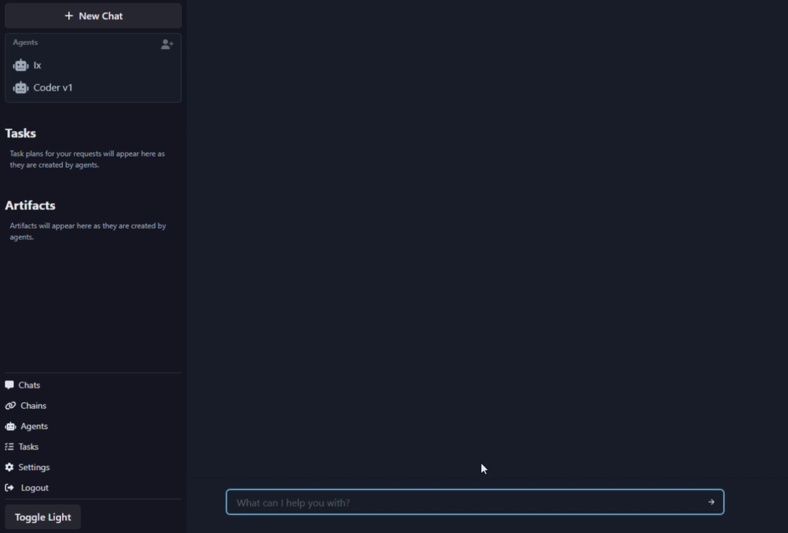

# iX - Autonomous GPT-4 Agent Platform

[](https://github.com/kreneskyp/ix/actions/workflows/test.yml)
[](https://discord.gg/jtrMKxzZZQ)
[](https://twitter.com/kreneskyp)

<div>

<p>
<br>
<br>
<br>
<br>
Amidst the swirling sands of the cosmos, Ix stands as an enigmatic jewel, 
where the brilliance of human ingenuity dances on the edge of forbidden 
knowledge, casting a shadow of intrigue over the galaxy.

\- Atreides Scribe, The Chronicles of Ixian Innovation
<p>
</div>
<div>
<br>
<br>
<br>
<br>
<br>
</div>


## About
<div>
Ix is an experimental platform for designing and deploying semi-autonomous LLM agents. It provides a scalable and
responsive solution for delegating tasks to AI powered agents. The platform is designed to be extensible, allowing
developers to create custom agents and chains to perform a wide variety of tasks.
<br>

The backend is designed to support multiple agents running in parallel and communicating with each other. Each agent
may be customized and may utilize parallel processes to complete tasks.
<br>

Ix uses GPT-4 by default, but agents may be configured to use any model supported by LangChain.
</div>

## How does it work



### Basic Usage
You chat with an agent that uses that direction to investigate, plan, and complete tasks. The agents are
capable of searching the web, writing code, creating images, interacting with other APIs and services. If it can be 
coded, it's within the realm of possibility that an agent can be built to assist you.

1. Setup the server and visit `http://localhost:8000`, a new chat will be created automatically

2. Enter a request and the Ix moderator will delegate the task to the agent best suited for the response. Or @mention
an agent to request a specific agent to complete the task.

3. Customized agents may be added or removed from the chat as needed to process your tasks

### Creating Custom Agents and Chains


Ix provides the moderator agent Ix, a coder agent, and a few example agents. Additional agents 
may be built using the chain editor or the python API. 

- Chains no-code editor
- Chains [python API docs](docs/chains/chains.rst)

Agents and chains are built from a graph of LangChain components. Each node in the graph is either a property config
node or a runnable Chain or Agent node. The graph configures the properties and the flow of the agent. 

Ix doesn't support all LangChain components yet, but it's easy to add new components. More will be added in subsequent
releases.


## Key Features

- Scalable model for running a fleet of GPT agents.
- Responsive user interface for interacting with agents.
- Graphical "no-code" editor for creating agents and chains.
- Persistent storage of interactions, processes, and metrics.
- Message queue for agent jobs and inter-agent communication.
- Deployment using Docker.

### Models
  - OpenAI
  - Google PaLM (Experimental)
  - Anthropic (Experimental)


### Stack
- Python 3.11
- Django 4.2
- PostgreSQL 15.3 + pg_vector
- GraphQL / Graphene / Relay
- React 18
- LangChain
- Integrated with OpenAI GPT models


## Setup

### 1. Prerequisites

Before getting started, ensure you have the following software installed on your system:

- git
- make
- Docker:
    - [Mac](https://docs.docker.com/desktop/install/mac-install/)
    - [Windows](https://docs.docker.com/desktop/install/windows-install/)


### 2. Clone the repository

```bash
git clone https://github.com/kreneskyp/ix.git
cd ix
```

### 3. Setup env

Setup config in `.env`

```bash
cp .env.template .env
```

```
OPENAI_API_KEY=YOUR_KEY_HERE
```

### Build and run the dev image.

```
make dev_setup
```

### Run the dev server & worker

```bash
make server
```

Start a worker
```bash
make worker
```


## Usage

Visit `http://localhost:8000` to access the user interface and start creating tasks for the autonomous GPT-4 agents. 
The platform will automatically spawn agent processes to research and complete tasks as needed.


### Scaling workers
Run as many worker processes as you want with `make worker`.


## Developer Tools

Here are some helpful commands for developers to set up and manage the development environment:

### Running:
- `make server`: Start the application in development mode on `0.0.0.0:8000`.
- `make worker`: Start an Agent worker.

### Building:
- `make image`: Build the Docker image.
- `make frontend`: Rebuild the front end (GraphQL, relay, webpack).
- `make webpack`: Rebuild JavaScript only.
- `make webpack-watch`: Rebuild JavaScript on file changes.
- `make dev_setup`: Builds frontend and generates database.

### Database
- `make migrate`: Run Django database migrations.
- `make migrations`: Generate new Django database migration files.

### Utility
- `make bash`: Open a bash shell in the Docker container.
- `make shell`: Open a Django shell_plus session.
