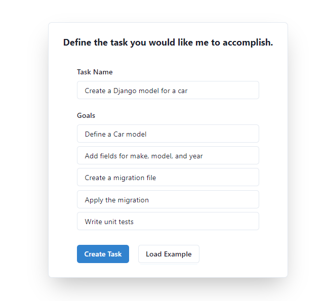
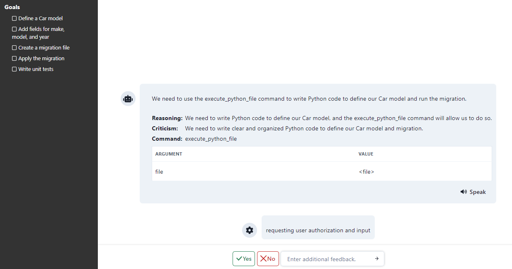

# iX - Autonomous GPT-4 Agent Platform

<div>

<p>
<br>
<br>
<br>
<br>
Amidst the swirling sands of the cosmos, Ix stands as an enigmatic jewel, 
where the brilliance of human ingenuity dances on the edge of forbidden 
knowledge, casting a shadow of intrigue over the galaxy.

\- Atreides Scribe, The Chronicles of Ixian Innovation
<p>
</div>
<div>
<br>
<br>
<br>
<br>
<br>
<br>
</div>


<div>
## About
iX is a platform to run semi-autonomous GPT-4 agents, providing a scalable and responsive solution for delegating tasks.
Agents can be spawned as individual processes to research and complete tasks through a web based interface while the 
backend architecture efficiently manages message queues and inter-agent communication between a fleet of workers.
<br>
<br>
The platform supports deployment using Docker containers, ensuring a consistent environment and enabling easy scaling 
to multiple worker containers.
</div>

## How does it work

You provide a task and goals and an agent uses that direction to investigate, plan, and complete tasks. The agents are
capable of searching the web, writing code, creating images, interacting with other APIs and services. If it can be 
coded, it's within the realm of possibility for an agent to assist.




**Note that this is an early version and should NOT be used in production. Agents require a human in the loop to provide
direction and halt the process if it goes off the rails.**

## Key Features

- Scalable model for running a fleet of GPT agents.
- Persistent storage of interactions, processes, and metrics
- Responsive user interface.
- Message queue for agent jobs and inter-agent communication
- Deployment using Docker.

## Technologies:
- Python 3.11
- Django 4.2
- PostgreSQL 14.4
- Graphql
- React 18
- Framework to support remote and local AI models including GPT-4
- Plugin architecture to support extending agent functionality (e.g. web browsing, debugging code, etc)
- Generic framework for vector database based agent memory
    - Pinecone
    - Redis
    - Milvus (soon)
    - FAISS (soon)

## Prerequisites

Before getting started, ensure you have the following software installed on your system:

- Docker
- Docker Compose

## Setup

Clone the repository:

```bash
git clone https://github.com/kreneskyp/ix.git
cd ix
```

Build and run the dev image:

```
make dev_setup
```

Run the dev server

```bash
make runserver
```

Start a worker
```bash
make worker
```


## Usage

Visit `http://localhost:8000` to access the user interface and start creating tasks for the autonomous GPT-4 agents. 
The platform will automatically spawn agent processes to research and complete tasks as needed.


### Scaling workers
Run as many worker processes as you want with `make worker`.


## Developer Setup

Here are some helpful commands for developers to set up and manage the development environment:

- `make runserver`: Start the application in development mode on `0.0.0.0:8000`.
- `make worker`: Start an Agent worker.
- `make image`: Build the Docker image.
- `make bash`: Open a bash shell in the docker container.
- `make shell`: Open a Django shell_plus session.
- `make migrate`: Run Django migrations.
- `make migrations`: Generate Django migration files.
- `make frontend`: Rebuild the front end.

To use these commands, ensure you have the appropriate `Makefile` set up in your project directory.
